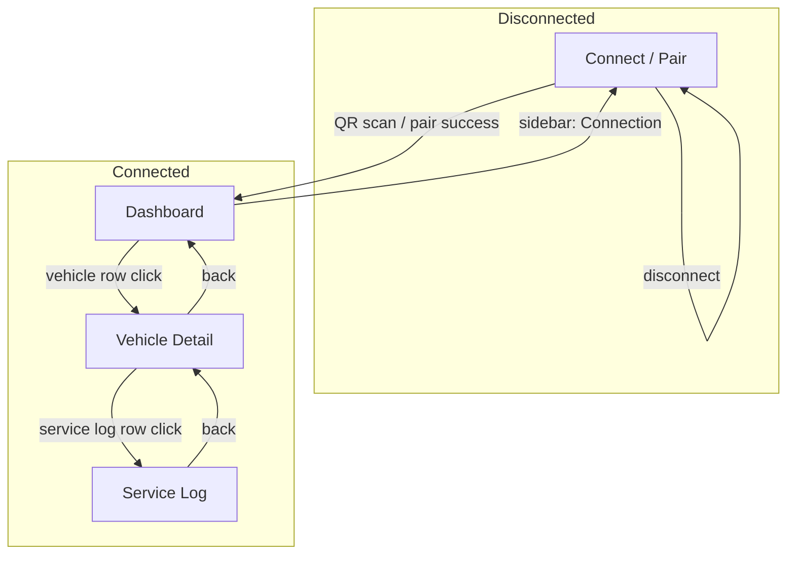

# Carport Monitor — UI Specification

> Layout and screen specs extracted from the Figma Make prototype for later
> Laravel / Livewire implementation. Design tokens and component recipes live in
> [design-language.md](../design-language.md); this folder documents **screens,
> navigation, and feature-specific layout**.

**Source prototype:** [Design Carport Monitor UI](https://www.figma.com/make/zSDdGa6t4hIaCwIzalfmX7/Design-Carport-Monitor-UI) (Figma Make `zSDdGa6t4hIaCwIzalfmX7`)

**Stack target:** Laravel 13 · Livewire 3 · Blade · Alpine · Industrial Dark tokens

---

## Product model

Carport Monitor is a **read-only web mirror** of the Carport mobile app. A phone
pairs via QR code; the web UI shows garage vehicles and service logs synced from
the device. No editing on web — all changes happen in the mobile app.

---

## Screen map

---

## Feature documents

| Document | Scope |
|----------|--------|
| [app-shell.md](app-shell.md) | Sidebar, top header, global layout |
| [connect.md](connect.md) | Pairing / QR connect screen |
| [dashboard.md](dashboard.md) | Garage overview, stats, vehicle list |
| [vehicle-detail.md](vehicle-detail.md) | Single vehicle read-only detail |
| [service-log.md](service-log.md) | Searchable maintenance log list |
| [shared-components.md](shared-components.md) | Cross-screen building blocks |

---

## Navigation state (prototype)

| State | `connected` | `screen` | `activeNav` |
|-------|-------------|----------|-------------|
| Waiting for pair | `false` | `connect` | `connection` |
| Paired — dashboard | `true` | `dashboard` | `dashboard` |
| Paired — vehicle | `true` | `vehicle` | unchanged |
| Paired — log | `true` | `log` | unchanged |
| Disconnected | `false` | `connect` | `connection` |

Sidebar items **Dashboard** and **Vehicles** both route to the dashboard in the
prototype. **Connection** returns to the connect screen (even when already
connected — useful for re-pairing).

---

## Layout constants (desktop web)

Unlike the mobile Carport app (max column ~384px), the Monitor prototype is a
**full-width desktop layout**:

| Region | Size / behavior |
|--------|-----------------|
| Sidebar | Fixed `240px`, full viewport height, `sidebar` bg (`#161618`) |
| Main column | `flex-1`, scrollable content area |
| Top header | `56px` (`h-14`), shown only when connected and not on connect screen |
| Content padding | `32px` (`p-8`) on main screens |
| Connect screen | Centered, `max-w-3xl` two-column grid at `lg` breakpoint |

Map colors, typography, and component recipes to [design-language.md](../design-language.md).
Additional sidebar-specific tokens are in the Make `theme.css` (`--sidebar`, etc.).

---

## Icons

Prototype uses [Lucide](https://lucide.dev). Per-screen usage is listed in each
feature doc. Prefer the same icon set in Blade (e.g. Blade UI Kit or inline SVG).

---

## Implementation order (suggested)

1. App shell + shared components
2. Connect screen (static QR + pairing flow)
3. Dashboard (vehicle list + stats)
4. Vehicle detail
5. Service log (search + list)
6. Live session / WebSocket sync (backend — out of scope for these UI docs)
